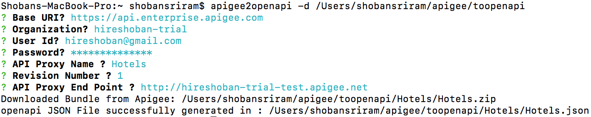

***

Apigee Edge:
------------

***

Policies 
-------------
1. Quota: These policies are defined in the preflow of proxy end point which is the first point of request interception
 - Default: Resets every start of minute (duration predefined) based on the time. (no type defined
 - Rolling window: Checks number of requests previous hour( predefined time) (type=”rollingwindow”)
 - Flexi Type:  The timer starts when the first request is made and the count increase starting then. (type=”flexi”) ..Type is case sensitive
 - Conditional: Based on the query param (request.queryparam.appTeam) the quota can be configured different.
 - Error Handling:  Custom error message for quota overflow: Use Allow tag and AssignMessage 
http://hireshoban-trial-test.apigee.net/quotacustomerrormessage --> Try 5 times and see the custom error message
 - Flow Variables: Leverage flow variables to intercept and display message for quota. 
http://hireshoban-trial-test.apigee.net/quotaflowvariabledemo --> Try 5 times and see the quota availablity
- Specific Quota with API Key: curl -i http://hireshoban-trial-test.apigee.net/quota-specific-to-key?apikey= 
- Adding a value when returning to client. http://hireshoban-trial-test.apigee.net/v1/kvm-get
- Creating and updating KVM : http://hireshoban-trial-test.apigee.net/kvm-create-update?kvmname=name&kvmvalue=shoban
- Caching values (tested for performance): http://hireshoban-trial-test.apigee.net/kvm-cache  
2. Security: TBD
3. Mediation: JSON to XML, XML to JSON, XML Transform, Assign Message, Extra Variables, Key Value Map Operations
   http://hireshoban-trial-test.apigee.net/v1/xmltojson
4. Extension: TBD

Note: All REST calls are configured to have either spike or quota limits. 

Baas
-------------

- Create maintain Users, Roles etc
- Environment variables for different environments (Prod, test etc), using in policies
- API Keys: Keys can be used to authorize use of API Products that developers use
- Developers registers Apps in Apigee, each App can use 0 or more API Products. We can expire and revocation keys,  
http://hireshoban-trial-test.apigee.net/quota-specific-to-key?apikey=

Tip: Sometimes APP is not revoked at management server immediately when you approve and revoke it repeatedly. If you want to revoke APP  immediately, you'll have to make sure that app is revoked at management server.
First of all Revoke App from Admin portal and then Check Status of app through this command:
curl -X GET -u <Admin-username>:<Password> "https://<IP>:8080/v1/organizations/tp/developers/{Developer-email Or ID}/apps/{App-Name}"
If Status is still Approved, then revoke app through this command:
curl -X POST --header "Content-Type: application/octet-stream" -u <Admin-username>:<Password> "https://<IP>:8080/v1/
organizations/tp/developers/{developer-email}/apps/{app-name}?action=revoke"

- API Keys generated for Never, Duration and Date 
- Create custom collection(entities) that are specific to your app. Data types like string, long, float, boolean, UUID, array, Object (JSON) are supported. 
- Operations supported are  '<' or 'lt'	, '<=' or 'lte',  '=' or 'eq',	'>=' or 'gte'	,'>' or 'gt'	, not, contains, and, or
- 

- Use SQL like queries to retrive data. ?ql= in URL indicates the start of query language. Functions like count(*) are not supported. 

Other
-------------
- Converted Apigee API spec to Open API spec (apigee2openapi), below is an example

- Using Postman tool for testing: Below is the url to import my test cases from postman. 
https://documenter.getpostman.com/view/3218907/collection/7EHbrwb
